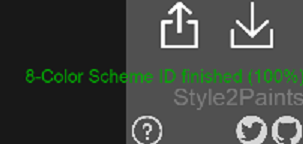
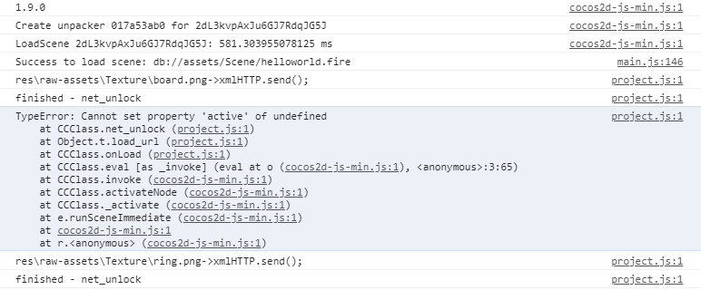

Style2Paints's official repository: [Link](https://github.com/lllyasviel/style2paints). (Thank the authors for providing such an awesome colorization project.)

# Style2Paints_V4.5_Patch

Develop stage: Beta 

This **unofficial** patch mainly aims at fixing some **small** UI problems in Style2Paints V4.5 (`Style2Paints V4.5.0.2-Beta (V2019.12.13)`).

Related issue:[#157](https://github.com/lllyasviel/style2paints/issues/157)

## Usage
1. Install: Use the patch files in the `patch/` dir to replace the corresponding official files.

2. Uninstall: Use the files in the `backup/` dir to replace the corresponding files.

## UI Fix
**Key assumption:** On PC (rather than GPU server), colorization usually takes a long time. (Considering many new PC are equipped with Integrated Graphics/AMD GPU.) 

 

### 1. Show color scheme ID

**Problem:** When saving project, it's hard for non-artist users to find out which color scheme has been selected. (It's hard for non-artist users to distinguish the selected color scheme from others, since many of them look quite similar.)

**Fix:** Show color scheme ID in the bottom right corner using green text.

(The HTTP request log in the cmd can't show the current selected color scheme, because of the browser's cache.)

### 2. Disable auto start colorization

**Problem:** 

(1) After uploading the sketch, users can't preview the selected color scheme BEFORE starting colorization. Without preview, it's hard to distinguish different color schemes on laptop's small screen.

(2) When attempting to upload the 2nd sketch, users can't select another color scheme for the 2nd sketch, and have to wait for coloring it by current color scheme. In other words, users can't choose another color scheme and upload the 2nd sketch at the same time.

(3) Users can't choose another reference image and upload the 2nd sketch at the same time.

 **Fix:**
Disable auto start colorization after selecting a color scheme. Disable auto start colorization after uploading a reference image. 

 **Now users need to click the "Magic Button" to start colorization.**

### 3. Enable Reference-based Colorization at the beginning

**Problem:** Can't upload a reference image **before** uploading a sketch. This means users have to wait for coloring by arbitrary color scheme first. After that, uploading a reference image is allowed.

 **Fix:** Allow uploading a reference image before uploading a sketch.

### Others:
1. Show error message, when the Aspect ratio of the reference image is larger than 2.5
2. Fix the following warning info in Chrome console, right after the ui is loaded. (Though it seems that it won't cause any problems.)

## UI Improvements

### 1. Color hints as json file

Instead of copying/pasting color hint points as string, now users can **upload/download hints as `.json` file**. It is more convenient, especially for users without programming background. 
 
 

## ChangeLog

v1.0.1 (2021.2.8)

Disable auto start colorization after uploading a reference image. 

Err Msg: Aspect ratio of the reference image

Fix: An undefined warning

 

v1.0.0 (2021.2.8)

initial version

---

Commercial usage without [Style2Paints's original author](https://github.com/lllyasviel)'s authorization is forbidden. This unofficial repo is distributed in the hope that it will be useful, but without any warranty.